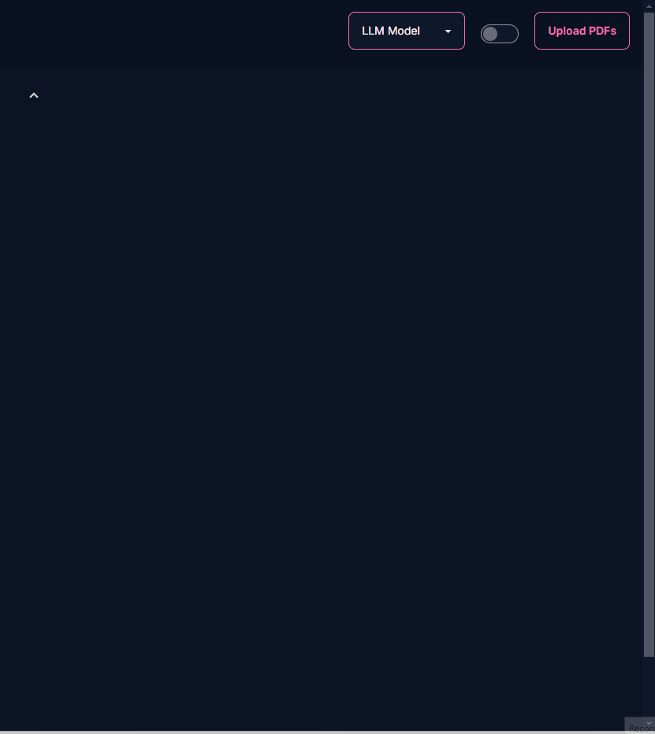

### Chat with Docs !!

- [x] REST API create embeddings and store them in ChromaDB
- [x] Huggingface LLMs integration
- [x] LLM chat with websocket
- [x] Conversational RAG
- [x] Frontend UI with NextJs

### List of LLMs

- Question answering: HuggingFaceH4/zephyr-7b-beta
- Embedding: all-MiniLM-L6-v2

### Chat output

